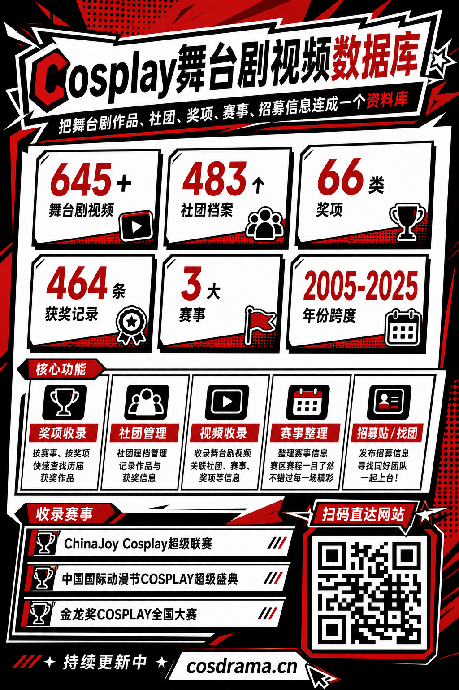
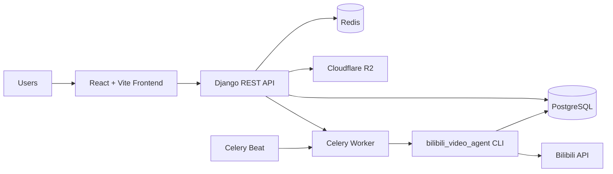

# Cosplay舞台剧视频数据库

[](https://www.cosdrama.cn/)

面向中文 Cosplay 舞台剧社区的全栈资料站，目标是把舞台剧作品、社团、奖项、赛事赛程、论坛招募信息整理成一个可持续维护的结构化数据库。

- 线上站点: [https://www.cosdrama.cn/](https://www.cosdrama.cn/)
- API 文档: [https://data.cosdrama.cn/api/docs/](https://data.cosdrama.cn/api/docs/)
- OpenAPI Schema: [https://data.cosdrama.cn/api/schema/](https://data.cosdrama.cn/api/schema/)

## 当前收录概览

以下数据来自线上接口，统计时间为 `2026-05-10`:

- `645+` 条舞台剧视频
- `483` 个社团档案
- `66` 类奖项
- `464` 条获奖记录
- `3` 个核心赛事
- `2005-2025` 年赛事时间跨度

当前重点收录赛事:

- `ChinaJoy Cosplay超级联赛`
- `中国国际动漫节COSPLAY超级盛典`
- `金龙奖COSPLAY全国大赛`

## 项目定位

这个项目不是单纯的视频列表页，而是围绕 Cos 舞台剧资料沉淀做的领域数据库，核心设计目标有三件事:

1. 把视频、社团、奖项、赛事、论坛内容关联起来，而不是孤立展示。
2. 让人工录入、批量导入、定时抓取三种数据来源能在同一套模型里汇合。
3. 同时服务普通用户浏览和贡献者维护，兼顾资料查询与社区协作。

## 核心功能

### 面向用户

- 视频检索与播放
  - 按年份、赛事、社团、标签等维度筛选舞台剧视频
  - 支持 Bilibili 视频链接与封面展示
- 奖项收录
  - 按赛事查看奖项定义
  - 按奖项或年份回溯历届获奖作品
- 社团管理
  - 社团档案、地区信息、作品数量、获奖数量
  - 社团详情与相关作品聚合展示
- 赛事与赛程
  - 赛事年份、赛区、晋级赛/总决赛等节点整理
  - 赛事视频与赛程事件关联
- 论坛与招募
  - 支持招募贴、找团、评论、反应、举报与基础版务能力
- 用户中心
  - JWT 登录、个人资料、头像上传、角色申请

### 面向维护者

- 数据导入
  - 支持 Excel 模板导入
  - 支持从 Bilibili URL 自动拉取元数据
- 权限控制
  - `viewer / contributor / editor / admin` 四级角色
  - 导入、管理、审批等能力按角色开放
- 定时视频采集
  - 通过 Celery Beat 每周执行一次最近一周 B 站检索
  - 结合 `bilibili_video_agent` 做结构化提取与入库辅助

## 系统架构

### 技术栈

- 后端: Django 4.2, Django REST Framework, PostgreSQL
- 前端: React 18, TypeScript, Vite, Redux Toolkit, Tailwind CSS
- 异步任务: Celery + Redis
- 对象存储: Cloudflare R2
- 富文本: TipTap
- 认证: JWT + django-allauth
- API 文档: drf-spectacular / OpenAPI 3

### 架构总览



### 分层设计

- 前端负责路由、状态管理、Persona 5 风格 UI 与交互编排。
- Django REST API 负责核心业务模型、权限、序列化与对外接口。
- PostgreSQL 保存结构化数据，是视频、社团、奖项、赛事、论坛内容的统一事实源。
- Redis 提供缓存和 Celery Broker/Result Backend。
- Celery 负责定时抓取、异步导入等后台工作。
- `bilibili_video_agent` 负责视频搜索、日期范围过滤、元数据抽取、外键匹配辅助。

## 仓库结构

```text
cosplay_web/
├── backend/                  # Django 后端
│   ├── apps/
│   │   ├── authentication/   # JWT、社交登录、上传签名
│   │   ├── users/            # 用户资料、角色申请、反馈
│   │   ├── videos/           # 视频模型、导入、统计、定时任务
│   │   ├── groups/           # 社团资料与聚合统计
│   │   ├── competitions/     # 赛事、年份、赛程事件
│   │   ├── awards/           # 奖项定义与获奖记录
│   │   ├── tags/             # 标签系统
│   │   ├── forum/            # 论坛、评论、举报、版务
│   │   ├── map/              # 地图数据
│   │   └── feedback/         # 用户反馈
│   ├── cosplay_api/          # settings / urls / celery
│   ├── upload_data/          # Excel 模板与导入辅助脚本
│   └── manage.py
├── src/                      # React 前端
│   ├── components/
│   ├── pages/
│   ├── services/
│   ├── store/
│   ├── styles/
│   └── types/
├── bilibili_video_agent/     # B 站检索与结构化提取 Agent
├── bilibili_crawler/         # 用户投稿维度的辅助爬虫
├── docs/                     # 设计与规划文档
└── README.md
```

## 数据模型设计

项目以“视频”为中心，但不是单表堆叠，而是显式维护多组关系:

- `Video`
  - 核心字段包括标题、BV 号、封面、年份、所属社团、所属赛事
- `Group`
  - 描述社团档案、地区、联系方式、聚合统计
- `Competition`
  - 描述赛事主体，如 ChinaJoy / 金龙奖 / CICAF
- `CompetitionYear`
  - 描述某赛事某一年的数据切片
- `Event`
  - 描述赛区、初赛、复赛、总决赛等时间节点
- `Award`
  - 描述某赛事下的奖项定义
- `AwardRecord`
  - 连接奖项、视频、社团和年份，是“谁获了什么奖”的事实表
- `ForumPost / Comment / Attachment / Report`
  - 承担招募贴、交流、治理等社区功能

这种建模方式保证了两个能力:

- 同一视频既能挂到社团，也能挂到赛事/赛程/奖项
- 同一奖项既能做奖项浏览，也能回查获奖作品与社团历史

## 关键业务流程

### 1. 视频录入流程

支持三条主要路径:

1. 管理页手动录入
   - 用户输入 Bilibili 链接
   - 后端接口拉取视频元数据
   - 管理员补充社团、赛事、标签等信息后保存
2. Excel 批量导入
   - 下载模板
   - 填写多行视频与社团资料
   - 发起异步导入并轮询状态
3. 定时抓取辅助
   - Celery 周期任务调用 `bilibili_video_agent`
   - 检索最近一周 B 站相关视频
   - 提取结构化字段并辅助建立外键关系

### 2. 奖项与获奖记录流程

- 奖项定义存放在 `awards`
- 获奖事实存放在 `awards/records`
- 前端可按奖项查看作品，也可按赛事/年份筛选
- 这套结构支持后续继续扩展“同一作品获得多个单项奖”的场景

### 3. 论坛招募流程

- 分类页定义 `招募`、`找团` 等板块
- 发帖支持富文本、附件、评论、点赞和举报
- 招募内容与站内视频资料库形成互补

## 每周爬取视频功能

这是当前项目里很关键的一条自动化链路，用来持续补充最近一周发布的 Cos 舞台剧视频。

### 调度方式

在 [backend/cosplay_api/settings.py](/Users/zhuzhiwei/subway_code/cosplay_web/backend/cosplay_api/settings.py:357) 中，Celery Beat 注册了一个固定周期任务:

```python
CELERY_BEAT_SCHEDULE = {
    'crawl-bilibili-videos-weekly': {
        'task': 'apps.videos.tasks.crawl_bilibili_videos_weekly',
        'schedule': crontab(hour=2, minute=0, day_of_week=1),
    },
}
```

当前策略是:

- 每周一 `02:00`，按 `Asia/Shanghai` 时区执行
- 任务过期时间为 `1` 小时

### 执行入口

实际任务位于 [backend/apps/videos/tasks.py](/Users/zhuzhiwei/subway_code/cosplay_web/backend/apps/videos/tasks.py:10)，会在项目根目录执行以下命令:

```bash
python3 -m bilibili_video_agent.cli "cos舞台剧" --last-week --page 1 --limit 999
```

这条命令的含义是:

- 关键词搜索 `cos舞台剧`
- 默认只关注最近一周数据
- 从第 `1` 页开始
- 单次尽可能拉取更多结果

### Agent 侧职责

`bilibili_video_agent` 负责:

- 调用 Bilibili 搜索接口
- 将日期范围转换为北京时间自然周区间
- 抽取标题、时间、表演信息等元数据
- 使用 PostgreSQL `pg_trgm` 做社团/赛事模糊匹配
- 生成适合入库的结构化结果

参考实现:

- [bilibili_video_agent/bilibili_api.py](/Users/zhuzhiwei/subway_code/cosplay_web/bilibili_video_agent/bilibili_api.py)
- [bilibili_video_agent/cli.py](/Users/zhuzhiwei/subway_code/cosplay_web/bilibili_video_agent/cli.py)
- [bilibili_video_agent/README.md](/Users/zhuzhiwei/subway_code/cosplay_web/bilibili_video_agent/README.md)

### 本地验证

可以直接手动跑一次最近一周抓取:

```bash
python3 -m bilibili_video_agent.cli "cos舞台剧" --last-week --page 1 --limit 20
```

也可以通过 Celery 测试任务验证链路:

```bash
python manage.py shell
>>> from apps.videos.tasks import test_bilibili_crawl
>>> test_bilibili_crawl.delay()
```

## API 设计

线上接口遵循 Django REST Framework 风格，核心资源包括:

- `/api/videos/`
- `/api/groups/`
- `/api/competitions/competitions/`
- `/api/competitions/events/`
- `/api/awards/`
- `/api/awards/records/`
- `/api/forum/posts/`
- `/api/users/`

扩展接口覆盖:

- 视频统计 `/api/videos/stats/`
- Excel 导入 `/api/videos/import/*`
- B 站元数据获取 `/api/videos/bilibili-metadata/`
- 赛事赛程 `/api/competitions/competitions/{id}/schedule/`
- 奖项按赛事筛选 `/api/awards/by_competition/`

## 前端设计

前端不是通用后台模板，而是有明确视觉方向:

- 视觉风格: Persona 5 风格，红白黑高对比、粗边框、漫画式构图
- 页面模式: 列表页 + 详情页 + 管理页 + 社区页
- 状态管理: Redux Toolkit 管理视频、社团、赛事、论坛等状态
- 网络层: `src/services/` 统一封装 axios 与鉴权拦截器

主要页面:

- 首页: 数据统计、视频列表、赛程入口
- 社团页: 社团聚合浏览
- 赛事页: 赛事列表 + 当前赛程 Tab
- 管理页: 视频、社团、赛事、奖项维护
- 用户中心: 头像、角色申请、反馈
- 论坛页: 招募/找团/讨论

## 本地开发

### 依赖要求

- Node.js 18+
- Python 3.11+
- PostgreSQL
- Redis

### 前端启动

```bash
npm install
npm run dev
```

### 后端启动

```bash
cd backend
uv venv
source .venv/bin/activate
pip install -r requirements.txt
python manage.py migrate
python manage.py runserver
```

### 一键启动

仓库提供了 [start_all.sh](/Users/zhuzhiwei/subway_code/cosplay_web/start_all.sh:1)，会同时启动:

- Vite 构建后的前端预览
- Django 开发服务器
- Celery Worker
- Celery Beat

```bash
./start_all.sh
```

默认本地地址:

- 前端: `http://localhost:4173/`
- 后端: `http://localhost:8000/`

## 环境变量

项目根目录与子模块会读取各自的 `.env` 配置。关键变量包括:

- Django / 数据库
  - `SECRET_KEY`
  - `DEBUG`
  - `DB_NAME`
  - `DB_USER`
  - `DB_PASSWORD`
  - `DB_HOST`
  - `DB_PORT`
- Redis / Celery
  - `REDIS_URL`
  - `CELERY_BROKER_URL`
  - `CELERY_RESULT_BACKEND`
- 存储
  - `AWS_S3_ACCESS_KEY_ID`
  - `AWS_S3_SECRET_ACCESS_KEY`
  - `AWS_STORAGE_BUCKET_NAME`
- Agent
  - `Bilibili_Cookies`
  - `FK_SIMILARITY_THRESHOLD`
  - `openai_api_key`
  - `GEMINI_API_KEY`

建议先参考:

- [backend/requirements.txt](/Users/zhuzhiwei/subway_code/cosplay_web/backend/requirements.txt)
- [.env.example](/Users/zhuzhiwei/subway_code/cosplay_web/.env.example)
- [bilibili_video_agent/README.md](/Users/zhuzhiwei/subway_code/cosplay_web/bilibili_video_agent/README.md)

## 适合继续演进的方向

- 把定时抓取结果进一步自动对接正式入库流程
- 为社团与作品建立更稳定的别名系统
- 增加更细的奖项维度和赛事赛区覆盖
- 引入更明确的审校工作流，区分“待确认”和“已核实”数据
- 增加站内搜索与统计分析页

## 许可证

仓库当前未声明正式开源许可证。如需公开发布，建议补充 `LICENSE` 与第三方资源说明。
